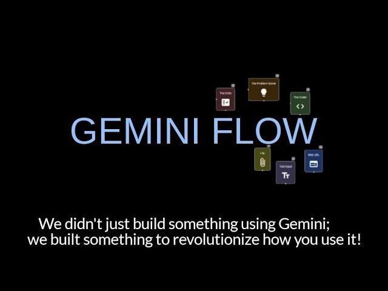

# Gemini Flow: Revolutionizing AI Workflows with Visual Programming


Gemini Flow is an innovative visual programming application designed to make working with Google Gemini LLMs (Large Language Models) intuitive, efficient, and visually engaging.

## Key Features

* **Design complex AI workflows visually:** Drag, drop, and connect agent nodes, like pieces of a puzzle, to create a flowchart that defines your AI pipeline.
* **Craft unique agents with distinct personalities:** Define specialized agents with roles like 'The Coder,' 'The Analyst,' or 'The Creative.' Adjust their 'temperature' settings to control their creativity and risk-taking. 
* **Seamlessly integrate context:**  Upload files, web pages, or text directly into your workflow, providing rich, dynamic input to specific agents or stages in your brainstorm.
* **Engage in real-time conversations:** Chat directly with individual agents to refine ideas, provide additional instructions, or get instant feedback on their progress.
* **Witness the magic of visual collaboration:** Watch as your agents "think" with animated pulses, demonstrating the flow of information, the mood of the interaction, and the synthesis of creative solutions. 
* **Automate your iterative process:**  Build feedback loops where agents automatically receive updates to your code or data, eliminating manual re-uploads and streamlining your workflow. 
* **Design your own AI team:**  Create and add specialized agents with custom instructions, skills, and personalities to tailor the application to your exact needs.  

## Built With

* **UI Framework:** Vue.js and Quasar Framework deliver a fast, modern, and visually appealing interface.
* **Graph Visualization:** Vue Flow library provides the mechanics for creating and manipulating the interactive flowchart, making it easy to connect and arrange agent nodes. 
* **Backend:** Node.js (or an alternative backend language) handles API interactions, file handling, secure storage, user authentication, and seamless communication with the Google Gemini API. 

## Installation

1. **Clone Repository:** 
   ```bash
   git clone https://github.com/CipherLab/lucid-brainstorm-vue3
   ```

2. **Install Dependencies:** 
   ```bash
   cd lucid-brainstorm-vue3
   yarn install  # Install all Node.js package dependencies
   ```

3. **(If needed) Install Quasar CLI:**
   ```bash
   yarn global add @quasar/cli  # If you don't have it already
   ```
4. **Run Development Server:**
   ```bash
   yarn dev   # Start the Quasar development server
   ```

## How Gemini Flow Works

1. **Define Your Brainstorm:** Start by providing a prompt, question, or objective in the central "Prefrontal Cortex" node. This sets the stage for your AI collaboration. 
2. **Assemble Your AI Team:** Drag and drop agent nodes from the palette. Each agent represents a unique persona or skill set (e.g., The Coder, The Architect, The Creative).
3. **Connect the Dots:** Draw lines between agents to define the flow of information. This visual map determines how data and ideas are exchanged during the brainstorming process. 
4. **Provide Context:** Upload files, web pages, or text to specific agents or stages in the flowchart. This adds rich, real-world data to guide the AI's thinking.
5. **Watch the Magic Unfold:** Your agents will come to life! Witness animated pulses of information as they "think," process data, and communicate with each other. 
6. **Get Instant Feedback:** Engage in real-time chat with any agent to ask questions, refine their output, or provide additional guidance. 
7. **Synthesize Insights:** The "Prefrontal Cortex" node analyzes the entire brainstorm session, providing a clear, concise summary based on the agents' collective output.

## Project Goals

* **Democratize AI:** Make the power of LLMs accessible to everyone, regardless of their technical expertise. 
* **Empower Developers:**  Streamline complex AI tasks and boost productivity by providing an intuitive and visually engaging workflow.
* **Explore Creative Potential:**  Discover new solutions and perspectives through AI-powered collaboration and the visualization of ideas. 
* **Showcase Gemini's Power:** Demonstrate the versatility and potential of the Google Gemini API through a unique and user-friendly application.


## Demo 
[](https://www.youtube.com/watch?v=jXhrP8a5hiM)

## Demo Site
[](https://geminiflowstorage.z5.web.core.windows.net/#/)

## Contributing

We welcome contributions! Feel free to open an issue for bug reports, feature requests, or submit pull requests to improve the code. Let's build the future of AI together! 

## Google Gemini App Competition

This project is proudly submitted to the Google Gemini App Competition. We believe Gemini Flow represents a significant step forward in the world of visual programming and AI collaboration, empowering users to unlock the full creative potential of LLMs.  

 
